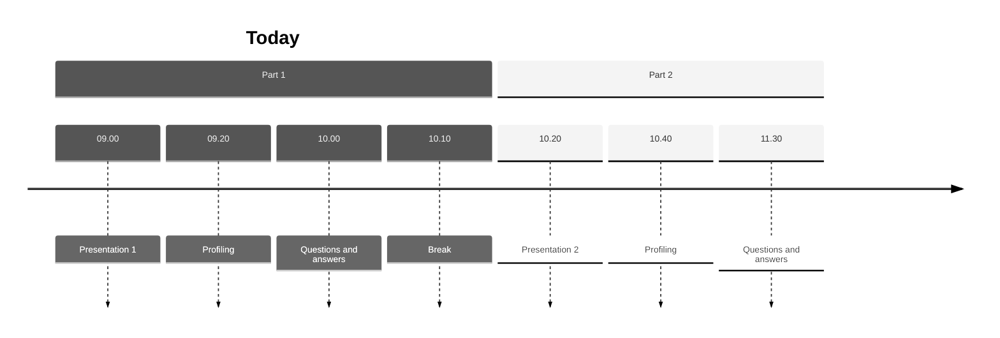

Welcome to Part 1
%%
This will hopefully be a fun workshop for everyone regardless of prior
knowledge. The idea is to explore the profiling tool perf, and it will be up to
you which level of complexity you target. Both newcomers and experienced
engineers are welcome.
%%

---

Requirements

`perf`

%%
But before the fun can begin we need to get some things out of the way. You are
expected to have either installed and verified that perf works well on your
machine, or paired yourself with a colleague with a working perf installation.
Regardless I encourage you to work together but alone is also fine.

These slides will be available together with the source code you will be
working with in a moment.
%%

---



---

Perf
%%
This will NOT be a thorough introduction to perf! I will introduce you to the
basics so we can save time for you to explore it on your own. 

With perf we can essentially let the processor tell us what it is up to by
instructing it to count some events such as clock cycles, data cache misses,
context switches and many more.
%%

```
perf list
```

%%
We will use perf to figure out if we can improve the running
time of 2 programs, one in each part. In part 1 we will look at a program which
tries to solve the `8-queens` toy problem using simulated annealing. In part 2
David will let you loose on a Gstreamer Pipeline.

To save all of you a lot of time, I will introduce you to the first program now.
%%

---
8-queens  

Place 8 queens on an 8 by 8 chess board such that no queen attacks another queen.

https://en.wikipedia.org/wiki/Eight_queens_puzzle

%%
In other words, no queens should share the same diagonal, row or column. There
are about 4 billion arrangements, and 92 solutions. Discounting reflections and rotations only 12 solutions remain.
We will be working with 100 queens on a 100 by 100 board.


[https://en.wikipedia.org/wiki/Eight_queens_puzzle]
%%

---

8-queens implementation
%%
An arrangement of queens, aka a board, is simply a list of which row the queen
in the column at that index is. Perhaps an example would make it clearer:
%%
```bash
  --------
3|- - - Q |
2|Q - - - |           This board is
1|- - Q - |           encoded as [2, 0, 1, 3]
0|- Q - - |
  --------
  0 1 2 3
```
%%
This actually kind of cheats since we cannot express an arrangement where two
queens are in the same column. 
%%

---

Simulated Annealing

```bash
fun hill-climber(initial-board)
	current = initial-board
    loop:
        neighbor = the highest value neighbor of current
        if neighbor.value <= current.value
            return current
        current = neighbor
```
%%
This is not a difficult problem to solve efficiently, so instead of looking at
a good solution, you will be examining a solution that uses simulated
annealing.

Before we go into simulated annealing though, lets look at a very simple way of
quickly getting to a *decent* solution: the hill-climbing algorithm.
1. The idea is to start with any valid arrangement of the problem for example
   imagine all the queens on a line on the first row, a shitty arrangement, but
   valid.
2. Examine the neighbors and pick the best one. (the 'move uphill' part)
3. If the best neighbor is as good as, or worse than, the current solution we are done
4. Otherwise repeat.

This algorithm is both great and horrible: If we start with a randomly
selected arrangement it only succeeds at finding a solution about 14 percent of
the time, however when it finds a solution it does so in only 4 steps on
average!

The reason that it fails most of the time is because it is prone to get stuck
on an local maximum, i.e all neighbors are worse but the current solution is
not the best. (And when it succeeds its probably because the random state was somewhat close to a solution)

Simulated annealing, the algorithm you will be looking at, tries to remedy this by introducing randomness.
%%

---

Simulated Annealing
```bash
fun simulated-annealing(initial-board, schedule)
  current = initial-board
  for t = 1 to infinity:
    T = schedule(t)
    if T = 0:
      return current
    next = get_random_neighbor(current)
    fitness_diff = next.value - current.value
    if fitness_diff > 0:
      current = next
    else if accept_worse_solution(T, fitness_diff):
      current = next
```
%%
It does so by accepting a worse arrangement with some probability that
decreases with time and with the difference in the arrangements value.

At every iteration the *temperature* will decrease according to a schedule
which will lower the probability of accepting a worse arrangement. At some
point the temperature reaches 0 and we halt.
%%

---

Implementation
%%
In order to apply simulated annealing to the 8 queens problem we only need 3
things: a cooling schedule,
%%

Cooling schedule
```c
src/main.c:

double
cooling_schedule (int step)
{
  return 1.0 / step;
}
```

---

Implementation
%%
a way of generating neighbors and
%%

neighbors
```c
src/queens.c:

queens *
queens_random_successor(queens *q)
{
  ...
  int column = rand_from_to(0, next->size);
  int new_row = rand_from_to(0, next->size);
  next->board[column] = new_row;

  return next;
}
```

---

Implementation
%%
a fitness evaluation function.
%%

fitness evaluation
```c
src/queens.c:

/* returns the number non-attacking *pairs* of queens */
int
queens_fitness(queens *q)
{
    ...
}
```

---

Implementation
```c
src/main.c:

int seed = 1;
/* use random seed for testing edge cases */
//int seed = (int) time(NULL);
srand(seed);
```

%%
Since the algorithm includes randomness it is a good idea to use a fixed seed
to make sure your optimizations don't change the output when they are not
supposed to. But if you do make optimizations that do change the output (which
is fine) make sure to test your program several times with different seeds to
verify that it still works as expected.

A final note on the program: it is far from optimized. You will see several
things that are prime targets for optimizing. But resist the urge to make
changes until you have verified that they have an impact with perf!
%%

---

Back to perf

---

Step 1:
```bash
                name of event to be profiled (cycles, 
                branch-misses, alignment-faults, 
                L1-icache-loads-misses, ...). Specify
                multiple events by separating them 
                with commas.
                ^
                |
perf record -e <EVENT> <command>
                        |
                        v
                        name of the program
```

%%
We are going to have perf record processor events for us. When an event is triggered, the processor records the current address which we can later map to the source code.

So in order to get a sense of where the processor spends time [next]
%%

---

Example
```bash
perf record -e cycles ./main.out
```

creates

```bash
./perf.data
```

%% We can record the *cycles* event. You can think of this as the CPU saving the address every X instructions.

'perf record' creates './perf.data' which contains all the recorded information.
%%

---

Step 2

```bash
perf report
```

```bash
# Total Lost Samples: 0
#
# Samples: 8K of event 'cycles'
# Event count (approx.): 9277056246
#
# Overhead  Command   Shared Object      Symbol                             
# ........  ........  .................  ...................................
#
    99.28%  main.out  main.out           [.] symbol a
     0.07%  main.out  main.out           [.] symbol b
     0.06%  main.out  [kernel.kallsyms]  [k] symbol c
     0.05%  main.out  libc-2.31.so       [.] symbol d
     0.05%  main.out  libc-2.31.so       [.] symbol e
	 ...
```

%% The data can be viewed with many tools, for now lets look at 'perf report' which presents us with all symbols and the number of times they were sampled.
%%

---

Step 2

```bash
perf annotate <symbol_name>
               |
               v
               For example 'main'
```

%%
we can also use the collected data to annotate the source code. With this tool we can pin point individual lines where the event occured.
%%

---

Step 3

Explore

%%
Find out which part of the program takes time. Bonus points: can you determine why? 
Tip use `perf list`
%%

---

Step 4

Fix it

```bash
hyperfine ./main.out
hyperfine ./slow.out ./fast.out
```

```bash
Benchmark 1: ./main.out
  Time (mean ± σ):      6.603 s ±  0.110 s    [User: 6.600 s, System: 0.002 s]
  Range (min … max):    6.467 s …  6.814 s    10 runs
```

%%
See if you can make the program run faster without changing the output of the program!

Use a benchmarking tool such as hyperfine to determine if your changes had the desired effect!

Write down what has worked and what didn't work so we can share our findings when we get back!
%%

---


---

Good luck!

```shell
git clone https://github.com/jacobjohnsson/simulated-annealing
```
